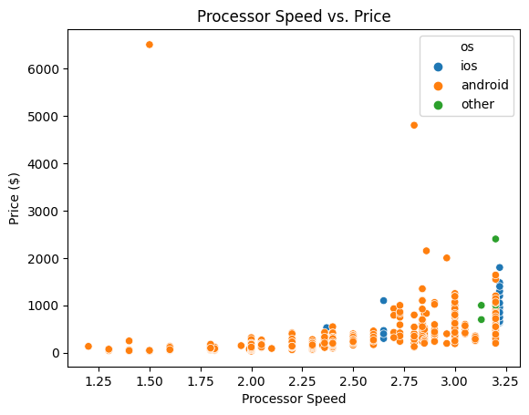

```import os
import pandas as pd
import seaborn as sns
import matplotlib.pyplot as plt

def prepare_smartphone_data(file_path):
    """
    To prepare the smartphone data for visualization, a number of transformations 
    will be applied after reading in the raw DataFrame to memory, including:
        - reducing the number of columns to only those needed for later analysis
        - removing records without a battery_capacity value
        - divide the price column by 100 to find the dollar amount
    
    :param file_path: the file path where the raw smartphone data is stored
    :return: a cleaned dataset having had the operations above applied to it
    """
    
    if os.path.exists(file_path):
        rawData = pd.read_csv(file_path)
        print(rawData.head())  # TODO: Use this for checking out the dataset, remove before submission
    else:
        raise Exception(f"File containing smartphone data not found at path {file_path}")

    columns_to_keep_in_clean_data = [
        "brand_name",
        "os",
        "price",
        "avg_rating",
        "processor_speed",
        "battery_capacity",
        "screen_size"
    ]
    trimmedData=rawData.loc[
    :, columns_to_keep_in_clean_data]
    
    # Remove records without a battery_capacity value
    reducedData=trimmedData.dropna(subset = ["battery_capacity", "os"])
    
    
    
    # Divide the price column by 100 to find the dollar amount
    reducedData["price"]=reducedData["price"]/ 100
    
    return reducedData


# Call the function
<<<<<<< HEAD
cleaned_data = prepare_smartphone_data("./data/smartphones.csv")
 
=======
cleaned_data = prepare_smartphone_data("./data/smartphones.csv")```

>>>>>>> parent of c108814 (Added the intro part in readme)

import seaborn as sns
import matplotlib.pyplot as plt


def column_to_label(column_name):
    """
    Converts a column name in a pandas DataFrame to a string that can be
    used as a label in a plot.
    
    :param column_name: string containing original column name
    :return: string that is ready to be presented on a plot
    """
    
    # Validate that column_name is a string
    if isinstance(column_name, str):
        return " ".join(column_name.split("_")).title()
    
    # If the value provided is not a string, raise an Exception
    else:
        raise Exception("Please makes sure to pass a value of type 'str'.")


def visualize_versus_price(clean_data, x):
    """
    Use seaborn and matplotlib to identify a pattern between avg_rating and 
    battery_capacity.
    
    :param clean_data: a pandas DataFrame containing cleaned smartphone data
    :param x: variable to be plotted on the x-axis
    :return: None
    """
    
    # Create the scatterplot
    sns.scatterplot(x=x, y="price", data=clean_data, hue="os")
    
    # Add x and y labels
    plt.xlabel(" ".join(x.split("_")).title())
    plt.ylabel("Price ($)")
    
    # Add a title to the plot
    plt.title(f"{' '.join(x.split('_')).title()} vs. Price")
    
    
# Call the visualize_versus_price function
visualize_versus_price(cleaned_data, "processor_speed")
```



```# Import required packages
import pytest
import ipytest

ipytest.config.rewrite_asserts = True
__file__ = "notebook.ipynb"


# Create a clean DataFrame fixture
@pytest.fixture()
def clean_smartphone_data():
    return prepare_smartphone_data("./data/smartphones.csv")

    
def test_nan_values(clean_smartphone_data):
    """
    Test for no NaN value for "battery_capacity" or "os"
    """
    
    # Assert there are no NaN value in "battery_capacity" or "os"
    assert clean_smartphone_data["battery_capacity"].isnull().sum() == 0
    assert not clean_smartphone_data["os"].isnull().sum() == 0

    
ipytest.run("-qq")

<<<<<<< HEAD
#### Error message:
=======
Error message:
>>>>>>> parent of c108814 (Added the intro part in readme)
F                                                                                            [100%]
============================================= FAILURES =============================================
_________________________________________ test_nan_values __________________________________________

clean_smartphone_data =     brand_name       os    price  avg_rating  processor_speed  battery_capacity  screen_size
0        apple      ios  ...90
979        zte  android   619.90         8.9             3.00            5000.0         6.80

[955 rows x 7 columns]

    def test_nan_values(clean_smartphone_data):
        """
        Test for no NaN value for "battery_capacity" or "os"
        """
    
        # Assert there are no NaN value in "battery_capacity" or "os"
        assert clean_smartphone_data["battery_capacity"].isnull().sum() == 0
>       assert not clean_smartphone_data["os"].isnull().sum() == 0
E       AssertionError

/tmp/ipykernel_212/3067794090.py:21: AssertionError
===================================== short test summary info ======================================
FAILED t_db157aa68f8b42518f867df347fce388.py::test_nan_values - AssertionError
<ExitCode.TESTS_FAILED: 1>
```